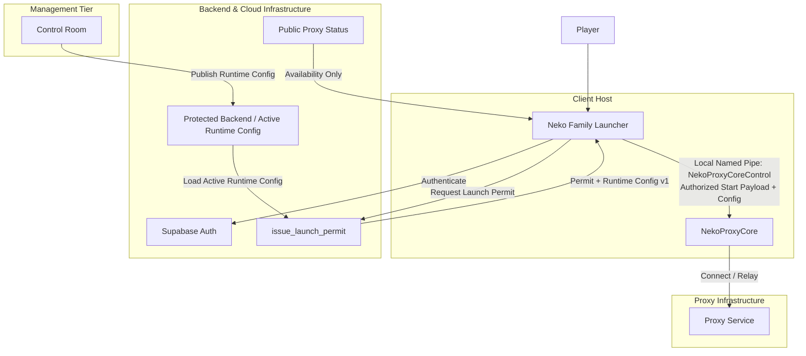

# Neko Family Proxy

<p align="center">
  
</p>

<p align="center">
  <strong>Secure Windows launcher and runtime orchestration for PSO2 NGS JP</strong><br>
  Built with fail-closed launch verification, single-active-session controls, and dynamic runtime proxy configuration.
</p>

<p align="center">
  <a href="#quick-start">Quick Start</a> &bull;
  <a href="#architecture">Architecture</a> &bull;
  <a href="#runtime-configuration">Runtime Config</a> &bull;
  <a href="#ecosystem">Ecosystem</a> &bull;
  <a href="#development--validation">Development</a> &bull;
  <a href="#roadmap">Roadmap</a> &bull;
  <a href="SECURITY.md">Security</a>
</p>

---

## Overview

**Neko Family Proxy** (`v5.0.0` stable) is the dedicated Windows desktop client and session orchestration tier for Phantasy Star Online 2 New Genesis JP. It bridges user authentication, account entitlement checks, bound launch permits, and external proxy core process supervision under strict fail-closed security guarantees.

### Key Capabilities

- **Fail-Closed Authorization**: External proxy core startup requires passing authentication, active entitlement validation, single launcher-session arbitration, target identity matching, and fresh cryptographically bound permit verification.
- **Runtime Config v1**: Real-time proxy configuration managed server-side and issued during authorization, allowing backend routing updates without desktop binary reinstalls.
- **Single-Active-Session Arbitration**: Prevents permit replay and concurrent conflicting client sessions across installations.
- **Credential Separation**: The client launcher uses strictly publishable credentials (Supabase URL and Supabase publishable client key). Elevated service keys and administrative authorities remain strictly backend-isolated.
- **Robust Quality Baseline**: Maintained with comprehensive automated test coverage (**878 passed, 3 skipped**) and automated repository safety verification.

---

## Architecture

The ecosystem splits responsibility across discrete, loosely-coupled components to enforce the principle of least privilege:



### Authorization & Control Flow

1. **Authentication**: Launcher authenticates against Supabase Auth using a Supabase publishable client key.
2. **Permit & Config Request**: Launcher requests `issue_launch_permit` from the Edge Function tier.
3. **Server-Side Loading**: `issue_launch_permit` loads the active Runtime Config v1 server-side and returns the bound launch permit alongside Runtime Config v1 to the authenticated Launcher session.
4. **Local Named Pipe IPC**: Launcher transfers the authorized start payload and runtime configuration to NekoProxyCore over the local named pipe `NekoProxyCoreControl`.
5. **Local Fail-Closed Verification**: NekoProxyCore validates the permit locally under its fail-closed trust boundary. Core does not call external Edge Functions to verify permits.
6. **Configuration Ownership**: Control Room publishes Runtime Config through its protected backend, which owns publication authority. The Launcher never directly accesses or polls the runtime configuration database.
7. **Decoupled Availability Signal**: Public Proxy Status provides a separate, sanitized availability check for the Launcher UI and is completely isolated from secret runtime configuration.

---

## Ecosystem

Neko Family Proxy operates as part of a coordinated multi-repository architecture:

- **[Neko Family Proxy (This Repository)](https://github.com/Valeneko-pranmong/Neko-Family-Proxy)**: The Windows desktop launcher application, local session manager, client telemetry display, and database migration suite.
- **[NekoProxyCore](https://github.com/Valeneko-pranmong/NekoProxyCore)**: The external, pinned low-level network proxy runtime. It executes fail-closed external traffic translation and is installed separately under `%LOCALAPPDATA%\NEKO FAMILY\ProxyCore`.
- **[Control Room](https://github.com/Valeneko-pranmong/Neko-Family-Proxy-admin-tool)**: The administrative management web portal utilized by operators to monitor proxy health, audit sessions, issue entitlements, and publish live Runtime Config v1 updates.

---

## Runtime Configuration

Starting in `v5.0.0`, the proxy ecosystem utilizes **Runtime Config v1**:
- **Server-Side Issuance**: The active runtime configuration is resolved server-side by `issue_launch_permit` and returned with the launch permit upon successful session authorization. The Launcher does not directly poll or query database endpoints.
- **Session Boundary Stability**: A fresh configuration is obtained per new authorized session. An active session is not mutated mid-session.
- **Next-Session Propagation**: Configuration updates or version changes apply on the next session start or reconnection.
- **Protected Publication**: Control Room publishes runtime configuration through its protected backend, ensuring validation and atomic updates without exposing internal routing data.

---

## Quick Start

### Prerequisites

- Windows 10/11 (64-bit)
- Valid PSO2 NGS JP installation
- Python 3.11+ (only if running from source)

### Packaged Stable Release (Recommended)

1. Download the `v5.0.0` release package from the [v5.0.0 Release Page](https://github.com/Valeneko-pranmong/Neko-Family-Proxy/releases/tag/v5.0.0).
2. Run `NekoLauncher.exe`.
3. Sign in with your account credentials.
4. Start PSO2 through the normal launcher flow.

*Note: Users do not need to enter or manage proxy credentials. Configuration and routing are handled automatically during session authorization.*

### Running from Source (Development)

```powershell
# Clone the repository
git clone https://github.com/Valeneko-pranmong/Neko-Family-Proxy.git
Set-Location Neko-Family-Proxy/launcher

# Install dependencies in editable mode
python -m pip install -e ".[dev,release]"

# Launch the desktop client
python -m neko_launcher.main
```

> **Note**: For packaged executable builds, refer to the [Windows executable build guide](docs/current/build-windows-executable.md).

---

## Development & Validation

All contributions must satisfy repository safety checks and existing test gates before merge:

```powershell
# 1. Run repository safety verification (credential leak checks)
python scripts/check_repository_safety.py

# 2. Run Python code quality linting
Set-Location launcher
python -m ruff check src tests

# 3. Execute test suite (878 passed, 3 skipped)
python -m pytest -q -m "not integration"
```

### Packaging Windows Binary

```powershell
Set-Location launcher
python -m PyInstaller --clean --noconfirm NekoLauncher.spec
```
The compiled output is placed in `launcher/dist/NekoLauncher.exe`.

---

## Security Policy

Security is central to Neko Family Proxy. Client distributions never contain secrets, administrative keys, or private proxy authority tokens.

- Review our full policy and reporting procedures in [SECURITY.md](SECURITY.md).
- To report a security vulnerability, please use GitHub Private Vulnerability Reporting on this repository if enabled, or contact the repository owner privately. Do not open public issues or pull requests for security vulnerabilities.

---

## Roadmap

- **v5.0.0 (Current Stable)**:
  - Baseline stable release.
  - Runtime Config v1 implementation.
  - Single active session control and bound launch permits.
  - Automated test coverage (878 passed, 3 skipped).
- **v5.1**:
  - Software Update Phase 2 (planned on the 5.1 development line).

---

## Documentation Index

- [Launcher Architecture](docs/current/launcher-architecture.md)
- [Repository Layout](docs/current/repository-layout.md)
- [Runtime Distribution Policy](docs/current/runtime-distribution.md)
- [NEKO-AUTH-LITE Contract](docs/current/neko-auth-lite.md)
- [Windows Executable Build Guide](docs/current/build-windows-executable.md)
- [Supabase Backend Architecture](supabase/README.md)
- [Full Documentation Portal](docs/README.md)
